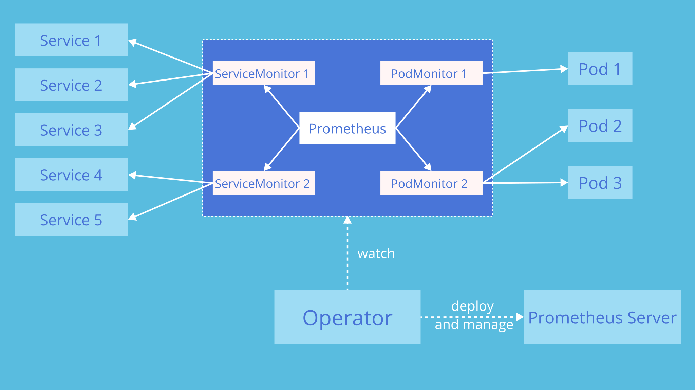

This guide explains how to use `PodMonitor` and `ServiceMonitor` objects to monitor targets for a sample application.

The `Prometheus` resource declaratively describes the desired state of a
Prometheus deployment, while `ServiceMonitor` and `PodMonitor` resources
describe the targets to be monitored by Prometheus.

## Pre-requisites

Before you begin, ensure that you have:

* A Kubernetes cluster with [admin](https://kubernetes.io/docs/reference/access-authn-authz/rbac/) permissions
* A running Prometheus Operator (refer to the [Installation]() page)
* A running Prometheus instance (refer to the [Platform Guide]())

<!-- do not change this link without verifying that the image will display correctly on https://prometheus-operator.dev -->



## Deploying a sample application

First, let's deploy a simple example application with 3 replicas which listens
and exposes metrics on port `8080`.

```yaml mdox-exec="cat example/user-guides/getting-started/example-app-deployment.yaml"
apiVersion: apps/v1
kind: Deployment
metadata:
  name: example-app
spec:
  replicas: 3
  selector:
    matchLabels:
      app: example-app
  template:
    metadata:
      labels:
        app: example-app
    spec:
      containers:
      - name: example-app
        image: quay.io/brancz/prometheus-example-app:v0.5.0
        ports:
        - name: web
          containerPort: 8080
```

## Using ServiceMonitors

To monitor the application using a `ServiceMonitor`, we will begin by exposing the application with a Service object that selects all the Pods with the label `app` set to `example-app` and specify the port where the metrics are exposed.

```yaml mdox-exec="cat example/user-guides/getting-started/example-app-service.yaml"
kind: Service
apiVersion: v1
metadata:
  name: example-app
  labels:
    app: example-app
spec:
  selector:
    app: example-app
  ports:
  - name: web
    port: 8080
```

Finally, we create a `ServiceMonitor` object that selects all Service objects
with the `app: example-app` label. The ServiceMonitor object also has a `team`
label (in this case `team: frontend`) to identify which team is responsible for
monitoring the application/service.

```yaml mdox-exec="cat example/user-guides/getting-started/example-app-service-monitor.yaml"
apiVersion: monitoring.coreos.com/v1
kind: ServiceMonitor
metadata:
  name: example-app
  labels:
    team: frontend
spec:
  selector:
    matchLabels:
      app: example-app
  endpoints:
  - port: web
```

Similarly, the Prometheus object defines which ServiceMonitors get selected with the
`spec.serviceMonitorSelector` field.

```
apiVersion: monitoring.coreos.com/v1
kind: Prometheus
metadata:
  name: prometheus
spec:
  serviceAccountName: prometheus
  serviceMonitorSelector:
    matchLabels:
      team: frontend
```

## Using PodMonitors

While `ServiceMonitor` requires a `Service` object, `PodMonitor` can bypass the service and find targets based on Pod labels. The `spec.selector` field in the `PodMonitor` resource specifies which Pods Prometheus should scrape.

```yaml mdox-exec="cat example/user-guides/getting-started/example-app-pod-monitor.yaml"
apiVersion: monitoring.coreos.com/v1
kind: PodMonitor
metadata:
  name: example-app
  labels:
    team: frontend
spec:
  selector:
    matchLabels:
      app: example-app
  podMetricsEndpoints:
  - port: web
```

Similarly, the Prometheus object defines which PodMonitors get selected with the
`spec.podMonitorSelector` field.

```
apiVersion: monitoring.coreos.com/v1
kind: Prometheus
metadata:
  name: prometheus
spec:
  serviceAccountName: prometheus
  podMonitorSelector:
    matchLabels:
      team: frontend
```

## What's Next




