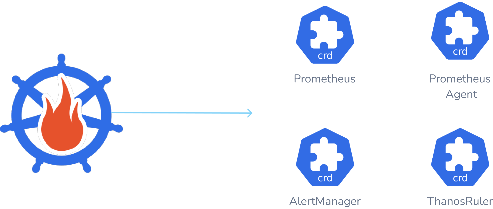
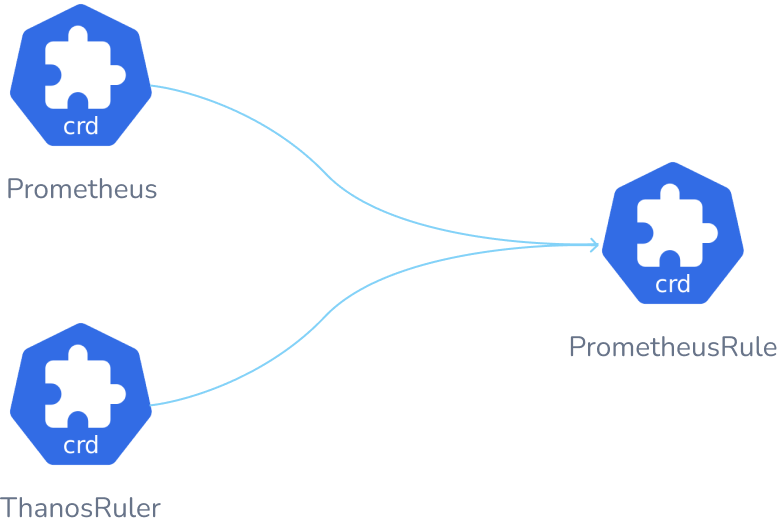

This document describes the design and interaction between the [custom resource definitions](https://kubernetes.io/docs/tasks/extend-kubernetes/custom-resources/) that the Prometheus Operator manages.

The custom resources managed by the Prometheus Operator are:

* [Prometheus](#prometheus)
* [Alertmanager](#alertmanager)
* [ThanosRuler](#thanosruler)
* [PrometheusAgent](#prometheus-agent)
* [ServiceMonitor](#servicemonitor)
* [PodMonitor](#podmonitor)
* [Probe](#probe)
* [ScrapeConfig](#scrapeconfig)
* [AlertmanagerConfig](#alertmanagerconfig)
* [PrometheusRule](#prometheusrule)

For a better understanding of all these custom resources, let us classify them into two major groups:

### Instance-Based Resources

Instance-based resources are used to manage the deployment and lifecycle of different components in the Prometheus ecosystem, as shown in the above figure. Let us look into the features of each of these custom resources:

#### Prometheus

The `Prometheus` CRD sets up a [Prometheus](https://prometheus.io/docs/prometheus) instance in a Kubernetes cluster. It allows configuration of replicas, persistent storage, and Alertmanagers for sending alerts. For each Prometheus resource, the Operator deploys `StatefulSet` objects (one per shard, default is 1) in the same namespace.

#### Alertmanager

The `Alertmanager` CRD sets up a [Alertmanager](https://prometheus.io/docs/alerting) instance in a Kubernetes cluster. It provides options to configure the number of replicas and persistent storage. For each `Alertmanager` resource, the Operator deploys a `StatefulSet` in the same namespace. For multiple replicas, the operator runs the Alertmanager instances in high availability mode.

#### ThanosRuler

The `ThanosRuler` CRD sets up a [Thanos Ruler](https://github.com/thanos-io/thanos/blob/main/docs/components/rule.md) instance in a Kubernetes cluster. It enables the processing of recording and alerting rules across multiple Prometheus instances. A `ThanosRuler` instance needs at least one `query endpoint` that connects to Thanos Queriers or Prometheus instances. More details can be found in the [Thanos section]().

#### Prometheus Agent

The `Prometheus Agent` CRD sets up a [Prometheus Agent](https://prometheus.io/blog/2021/11/16/agent/) instance in a Kubernetes cluster. While similar to the `Prometheus` CR, the `Prometheus Agent` has several configuration options redacted, including alerting, PrometheusRules selectors, remote-read, storage, and Thanos sidecars. To understand why Agent support was introduced, read the [proposal here](https://github.com/prometheus-operator/prometheus-operator/blob/main/Documentation/proposals/202201-prometheus-agent.md).

### Config-Based Resources

Config-based resources focus on managing the monitoring of resources and scraping metrics within a Kubernetes cluster. They define how metrics are collected, processed, and managed, rather than managing the deployment of the monitoring components themselves. For a clear picture, let us look at the relation of config-based resources with instance based resources.

The `Prometheus` and `PrometheusAgent` CRDs use the `podMonitorSelector`, `serviceMonitorSelector`, `probeSelector`, and `scrapeConfigSelector` fields to determine which `ServiceMonitor`, `PodMonitor`, `Probe`, and `ScrapeConfig` configurations should be included in the `Prometheus` and `PrometheusAgent` instances for scraping.

#### ServiceMonitor

The `ServiceMonitor` CRD defines how a dynamic set of services should be monitored. A `Service` object discovers pods by a label selector and adds those to the `EndpointSlice` or `Endpoints` object. The `ServiceMonitor` object discovers those `EndpointSlice` or `Endpoints` objects and configures Prometheus to monitor those pods. The services selected to be monitored with the desired configuration are defined using label selections.

#### PodMonitor

The `PodMonitor` CRD defines how a dynamic set of pods should be monitored. The `PodMonitor` object discovers these pods and generates the relevant configuration for the Prometheus server to monitor them. The pods selected to be monitored with the desired configuration is defined using label selections.

#### Probe

The `Probe` CRD defines how groups of ingresses and static targets should be monitored. Besides the target, the `Probe` object requires a `prober` which is the service that monitors the target and provides metrics for Prometheus to scrape. Typically, this is achieved using the [blackbox exporter](https://github.com/prometheus/blackbox_exporter).

#### ScrapeConfig

The `ScrapeConfig` CRD allows you to define how Prometheus should discover and scrape metrics from target services. You can use the `ScrapeConfig` CRD to scrape targets external to the Kubernetes cluster or to create scrape configurations that are not possible with the higher-level `ServiceMonitor`, `Probe`, or `PodMonitor` resources. Both the `Prometheus` and `PrometheusAgent` CRDs have a `scrapeConfigSelector` field, which needs to be set to a list of labels to match ScrapeConfigs.

#### AlertmanagerConfig

The `AlertmanagerConfig` CRD allows us to configure `Alertmanager` instances in a Kubernetes cluster. It specifies subsections of the Alertmanager configuration, enabling the routing of alerts to custom receivers and the setting of inhibition rules.

#### PrometheusRule

The `PrometheusRule` CRD allows the definition of alerting and recording rules to be consumed by Prometheus or Thanos Ruler instances. Alerts and recording rules are reconciled by the Operator and dynamically loaded without requiring a restart of Prometheus or Thanos Ruler.
