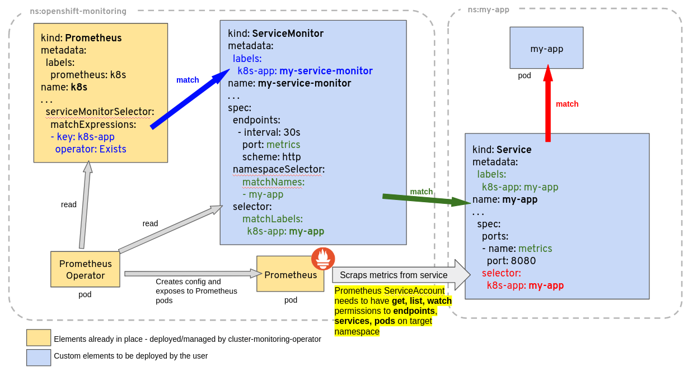

### `CustomResourceDefinition "..." is invalid: metadata.annotations: Too long` issue

When applying updated CRDs on a cluster, you may face the following error message:

```bash
$ kubectl apply -f $MANIFESTS
The CustomResourceDefinition "prometheuses.monitoring.coreos.com" is invalid: metadata.annotations: Too long: must have at most 262144 bytes
```

The reason is that apply runs in the client by default and saves information into the object annotations but there's a hard limit on the size of annotations.

The workaround is to use server-side apply which requires Kubernetes v1.22 at least.

```bash
kubectl apply --server-side --force-conflicts -f $MANIFESTS
```

If using ArgoCD, please refer to their [documentation](https://argo-cd.readthedocs.io/en/latest/user-guide/sync-options/#server-side-apply).

### RBAC on Google Container Engine (GKE)

When you try to create `ClusterRole` (`kube-state-metrics`, `prometheus` `prometheus-operator`, etc.) on GKE Kubernetes cluster running 1.6 version, you will probably run into permission errors:

```
<....>
Error from server (Forbidden): error when creating
"manifests/prometheus-operator/prometheus-operator-cluster-role.yaml":
clusterroles.rbac.authorization.k8s.io "prometheus-operator" is forbidden: attempt to grant extra privileges:
<....>
```

This is due to the way Container Engine checks permissions. From [Google Kubernetes Engine docs](https://cloud.google.com/kubernetes-engine/docs/how-to/role-based-access-control):

> Because of the way Container Engine checks permissions when you create a Role or ClusterRole, you must first create a RoleBinding that grants you all of the permissions included in the role you want to create.
> An example workaround is to create a RoleBinding that gives your Google identity a cluster-admin role before attempting to create additional Role or ClusterRole permissions.
> This is a known issue in the Beta release of Role-Based Access Control in Kubernetes and Container Engine version 1.6.

To overcome this, you must grant your current Google identity `cluster-admin` Role:

```console
# get current google identity
$ gcloud info | grep Account
Account: [myname@example.org]

# grant cluster-admin to your current identity
$ kubectl create clusterrolebinding myname-cluster-admin-binding --clusterrole=cluster-admin --user=myname@example.org
Clusterrolebinding "myname-cluster-admin-binding" created
```

### Troubleshooting ServiceMonitor changes

When creating/deleting/modifying `ServiceMonitor` objects it is sometimes not as obvious what piece is not working properly. This section gives a step by step guide how to troubleshoot such actions on a `ServiceMonitor` object.

#### Overview of `ServiceMonitor` tagging and related elements

A common problem related to `ServiceMonitor` identification by Prometheus is related to the object's labels not matching the `Prometheus` custom resource definition scope, or lack of permission for the Prometheus `ServiceAccount` to *get, list, watch* `Services` and `Endpoints` from the target application being monitored. As a general guideline consider the diagram below, giving an example of a `Deployment` and `Service` called `my-app`, being monitored by Prometheus based on a `ServiceMonitor` named `my-service-monitor`:

<!-- do not change this link without verifying that the image will display correctly on https://prometheus-operator.dev -->



Note: The `ServiceMonitor` references a `Service` (not a `Deployment`, or a `Pod`), by labels *and* by the port name in the `Service`. This *port name* is optional in Kubernetes, but must be specified for the `ServiceMonitor` to work. It is not the same as the port name on the `Pod` or container, although it can be.

#### Has my `ServiceMonitor` been picked up by Prometheus?

`ServiceMonitor` objects and the namespace where they belong are selected by the `serviceMonitorSelector` and `serviceMonitorNamespaceSelector`of a Prometheus object. The name of a `ServiceMonitor` is encoded in the Prometheus configuration, so you can simply grep whether it is present there. The configuration generated by the Prometheus Operator is stored in a Kubernetes `Secret`, named after the Prometheus object name prefixed with `prometheus-` and is located in the same namespace as the Prometheus object. For example for a Prometheus object called `k8s` one can find out if the `ServiceMonitor` named `my-service-monitor` has been picked up with:

```sh
kubectl -n monitoring get secret prometheus-k8s -ojson | jq -r '.data["prometheus.yaml.gz"]' | base64 -d | gunzip | grep "my-service-monitor"
```

You can also use [port forwarding](https://kubernetes.io/docs/tasks/access-application-cluster/port-forward-access-application-cluster/) to access the Prometheus web.

```sh
kubectl -n monitoring port-forward svc/prometheus-operated 9090:9090
```

If the command runs successfully, you should be able to access the [Prometheus server UI](http://localhost:9090/) via localhost. From there you can check the live configuration and the discovered targets.

#### Debugging why monitoring resource spec changes are not reconciled

The Prometheus Operator will reject invalid resources and not reconcile them in the Prometheus configuration. When it happens the Operator emits a Kubernetes Event detailing the issue.

Events are supported for the following resources:
* `AlertmanagerConfig`
* `PrometheusRule`
* `ServiceMonitor`
* `PodMonitor`
* `Probe`
* `ScrapeConfig`

To check for events related to rejected resources, you can use the following command:

```sh
kubectl get events --field-selector=involvedObject.name="<name of PodMonitor resource>" -n "<namespace where resource is deployed>"
```

If you've deployed the Prometheus Operator using kube-prometheus manifests, the `PrometheusOperatorRejectedResources` alert should fire when invalid objects are detected.
The alert can be found in the [kube-prometheus-stack repository](https://github.com/prometheus-community/helm-charts/blob/db5b859d111c2c81534c5b716aff417f13b51d2b/charts/kube-prometheus-stack/templates/prometheus/rules-1.14/prometheus-operator.yaml#L226)

#### It is in the configuration but not on the Service Discovery page

ServiceMonitors pointing to Services that do not exist (e.g. nothing matching `.spec.selector`) will lead to this ServiceMonitor not being added to the Service Discovery page. Check if you can find any Service with the selector you configured.

If you use `.spec.selector.matchLabels` (instead of e.g. `.spec.selector.matchExpressions`), you can use this command to check for services matching the given label:

```
kubectl get services -l "$(kubectl get servicemonitors -n "<namespace of your ServiceMonitor>" "<name of your ServiceMonitor>" -o template='{{ $first := 1 }}{{ range $key, $value := .spec.selector.matchLabels }}{{ if eq $first 0 }},{{end}}{{ $key }}={{ $value }}{{ $first = 0 }}{{end}}')"
```

Note: this command does not take namespaces into account. If your ServiceMonitor selects a single namespace or all namespaces, you can just add that to the `kubectl get services` command (using `-n $namespace` or `-A` for all namespaces).

### Prometheus kubelet metrics server returned HTTP status 403 Forbidden

Prometheus is installed, all looks good, however the `Targets` are all showing as down. All permissions seem to be good, yet no joy. Prometheus pulling metrics from all namespaces expect kube-system, and Prometheus has access to all namespaces including kube-system.

#### Did you check the webhooks?

Issue has been resolved by amending the webhooks to use `0.0.0.0` instead of `127.0.0.1`. Follow the below commands and it will update the webhooks which allows connections to all `clusterIP's` in all `namespaces` and not just `127.0.0.1`.

**Update the kubelet service to include webhook and restart:**

```sh
KUBEADM_SYSTEMD_CONF=/etc/systemd/system/kubelet.service.d/10-kubeadm.conf
sed -e "/cadvisor-port=0/d" -i "$KUBEADM_SYSTEMD_CONF"
if ! grep -q "authentication-token-webhook=true" "$KUBEADM_SYSTEMD_CONF"; then
  sed -e "s/--authorization-mode=Webhook/--authentication-token-webhook=true --authorization-mode=Webhook/" -i "$KUBEADM_SYSTEMD_CONF"
fi
systemctl daemon-reload
systemctl restart kubelet
```

**Modify the kube controller and kube scheduler to allow for reading data:**

```sh
sed -e "s/- --address=127.0.0.1/- --address=0.0.0.0/" -i /etc/kubernetes/manifests/kube-controller-manager.yaml
sed -e "s/- --address=127.0.0.1/- --address=0.0.0.0/" -i /etc/kubernetes/manifests/kube-scheduler.yaml
```

### Using textual port number instead of port name

The ServiceMonitor expects to use the port name as defined on the Service. So, using the Service example from the
diagram above, we have this Service definition:

```yaml mdox-exec="cat example/user-guides/getting-started/example-app-service.yaml"
kind: Service
apiVersion: v1
metadata:
  name: example-app
  labels:
    app: example-app
spec:
  selector:
    app: example-app
  ports:
  - name: web
    port: 8080
```

We would then define the service monitor using `web` as the port, not `"8080"`. E.g.

**CORRECT**

```yaml mdox-exec="cat example/user-guides/getting-started/example-app-service-monitor.yaml"
apiVersion: monitoring.coreos.com/v1
kind: ServiceMonitor
metadata:
  name: example-app
  labels:
    team: frontend
spec:
  selector:
    matchLabels:
      app: example-app
  endpoints:
  - port: web
```

**INCORRECT**

```yaml
apiVersion: monitoring.coreos.com/v1
kind: ServiceMonitor
metadata:
  name: example-app
  labels:
    team: frontend
spec:
  selector:
    matchLabels:
      app: example-app
  endpoints:
  - port: "8080"
```

The incorrect example will give an error along these lines `spec.endpoints.port in body must be of type string: "integer"`

### Prometheus/Alertmanager pods stuck in terminating loop with healthy start up logs

It is usually a sign that more than one operator wants to manage the resource.

Check if several operators are running on the cluster:

```console
kubectl get pods --all-namespaces | grep 'prom.*operator'
```

Check the logs of the matching pods to see if they manage the same resource.

If running multiple operators is desired, make sure to set the `--controller-id` flag for each operator instance to a different value. When `--controller-id` is set, the operator instance will only reconcile resources that have a `operator.prometheus.io/controller-id` annotation matching the value of `--controller-id` (eg: an operator with the flag `--controller-id=my-objects` will only reconcile objects that have `operator.prometheus.io/controller-id: my-objects` annotation on them). This allows multiple operator instances to run in the same cluster without conflicting over the same resources.

Note: it is the responsibility of the resource owner (the user applying the resource) to set the `operator.prometheus.io/controller-id` annotation on the resources. The operator will not set this annotation automatically.

If the `--controller-id` flag is not set, the operator will try to reconcile all resources, except the ones that have the `operator.prometheus.io/controller-id` annotation set. This can lead to conflicts (such as pods stuck in terminating loop) and should be avoided.

The following table illustrates the behavior based on whether the `--controller-id` flag is set and whether the `operator.prometheus.io/controller-id` annotation is present on the resources:

| Operator started with with the `--controller-id` flag | Resource with the `operator.prometheus.io/controller-id` annotation | Behavior                                                                            |
|-------------------------------------------------------|---------------------------------------------------------------------|-------------------------------------------------------------------------------------|
| Yes                                                   | Yes                                                                 | The operator reconciles the resource only if the annotation value matches the flag. |
| Yes                                                   | No                                                                  | The operator does not reconcile the resource                                        |
| No                                                    | Yes                                                                 | The operator does not reconcile the resource.                                       |
| No                                                    | No                                                                  | The operator reconciles the resource.                                               |

### Configuring Prometheus/PrometheusAgent for Mimir and Grafana Cloud

Mimir and Grafana Cloud can receive samples via Prometheus remote-write and are able to [deduplicate samples](https://grafana.com/docs/mimir/latest/configure/configure-high-availability-deduplication/) received from HA pairs of Prometheus/PrometheusAgent instances, provided that you configure proper labels.

By default, the deduplication labels are:
* `cluster`, it identifies the HA pair and should have the same value for both instances.
* `__replica__`, it should have a different value for each instance.

The Prometheus operator already configures the `prometheus_replica` external label with the same semantic as `__replica__` in Grafana Mimir. The label name can be changed to `__replica__` by setting the `.spec.replicaExternalLabelName` field. When running a self-managed Mimir, it's also possible to configure different deduplication labels on the Mimir side (check the Mimir documentation).

When it's not possible to change the Prometheus replica external label, a simple solution is to leverage `writeRelabelConfigs`. Here is a full example:

```yaml
apiVersion: monitoring.coreos.com/v1
kind: Prometheus
metadata:
  name: example
spec:
  podMonitorSelector: {}
  ruleSelector: {}
  serviceMonitorSelector: {}
  externalLabels:
    # Configure a `cluster` label identifying the HA pair.
    cluster: my-awesome-cluster
  remoteWrite:
  - url: <remote write URL>
    writeRelabelConfigs:
    # Rename the default `prometheus_replica` label to `__replica__` as expected by Grafana cloud.
    # It happens in 2 steps:
    # 1. Copy the `prometheus_replica` label value to the `__replica__` label.
    - sourceLabels: [prometheus_replica]
      targetLabel: __replica__
    # 2. Drop the `prometheus_replica` label.
    - regex: prometheus_replica
      action: LabelDrop
    # Add more relabel configs here.
```

For Prometheus/Prometheus resources with multiple shards, there's another modification to be done since the `cluster` label needs to include the shard ID for proper deduplication.

```yaml
apiVersion: monitoring.coreos.com/v1
kind: Prometheus
metadata:
  name: example
spec:
  podMonitorSelector: {}
  ruleSelector: {}
  serviceMonitorSelector: {}
  externalLabels:
    # The config-reloader container will expand the `$(SHARD) string with the actual shard ID.
    cluster: my-awesome-cluster-$(SHARD)
  remoteWrite:
  - url: <remote write URL>
    writeRelabelConfigs:
    - sourceLabels: [prometheus_replica]
      targetLabel: __replica__
    - regex: prometheus_replica
      action: LabelDrop
```
