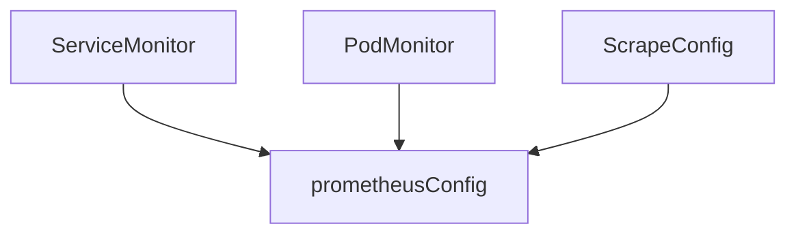
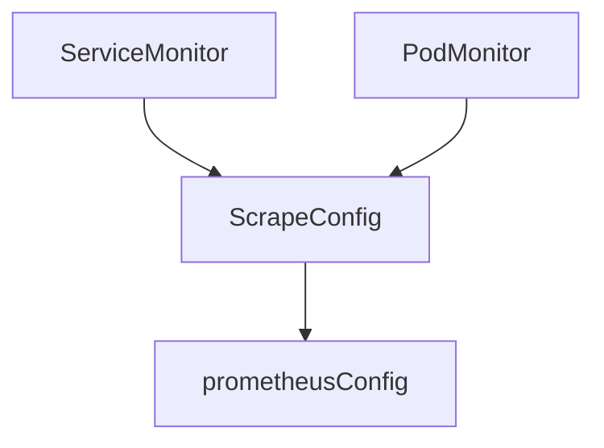

# ScrapeConfig CRD
* Owners:
  * [xiu](https://github.com/xiu)
* Related Tickets:
  * [#2787](https://github.com/prometheus-operator/prometheus-operator/issues/2787)
  * [#3447](https://github.com/prometheus-operator/prometheus-operator/issues/3447)
* Other docs:
  * n/a

This document aims at creating a lower level `ScrapeConfig` Custom Resource  Definition that defines additional scrape configurations the Kubernetes way.

# Why

prometheus-operator misses a way to scrape external targets using CRD. Users have either been abusing the Probe CRD (#3447) or additionalScrapeConfig to do so.
Furthermore, currently, there is a lot of code duplication due to the operator supporting several CRDs that generate scrape configurations. With the new `ScrapeConfig` CRD, it would be possible to consolidate some of that logic, where the other `*Monitor` CRDs could be migrated so that they create a ScrapeConfig resource that would ultimately be used by the operator to generate scrape configuration.

## Pitfalls of the current solution

Using `additionalScrapeConfig` comes with drawbacks:
* teams have to build an infrastructure to add scrape rules in a centralized manner, which creates a bottleneck since a single team becomes responsible for the configuration
* there is no input validation, which can lead to an invalid prometheus configuration

# Goals
* Provide a way for users to self-service adding scrape targets
* Consolidate the scrape configuration generation logic in a central point for other resources to use

## Audience
* Users who serve Prometheus as a service and want to have their customers autonomous in defining scrape configs
* Users who want to manage scrape configs the same way as for services running within the Kubernetes cluster
* Users who want a supported Kubernetes way of scraping targets outside the Kubernetes cluster

# Non-Goals
* This proposal doesn't aim at covering all the fields in [`<scrape_config>`](https://prometheus.io/docs/prometheus/latest/configuration/configuration/#scrape_config). Specifically, no service discovery other than `static_configs` or `file_sd_configs` should be implemented at first.
* refactoring of the other CRDs is not in scope for the first version

# How

As described by [@aulig in #2787](https://github.com/prometheus-operator/prometheus-operator/issues/2787#issuecomment-559776221), we will create a new `ScrapeConfig` CRD, this config will act the same as the other CRDs and append scrape configurations to the configuration. `ScrapeConfig` will allow for any scraping configuration, while the other CRDs provide sane defaults. This will allow for isolated testing of the new `ScrapeConfig` CRD.



Using a pseudo custom resource definition, we should have the following:

```yaml
apiVersion: monitoring.coreos.com/v1alpha1
kind: ScrapeConfig
metadata:
  name: my-scrape-config
  namespace: system-monitoring
  labels:
    test: value
spec:
  staticConfigs:
    - <StaticConfig>[] # new resource
  fileSDConfigs:
    - <fileSDConfig>[] # new resource
  relabelConfigs:
    - <RelabelConfig>[] # https://github.com/prometheus-operator/prometheus-operator/blob/e4e27052f57040f073c6c1e4aedaecaaec77d170/pkg/apis/monitoring/v1/types.go#L1150
  metricsPath: /metrics
```

with `StaticConfig` being:

```yaml
targets:
  - target:9100
labels:
  labelA: placeholder
```

and `fileSDConfig`:

```yaml
files:
  - <SecretOrConfigMap>[] # https://github.com/prometheus-operator/prometheus-operator/blob/e4e27052f57040f073c6c1e4aedaecaaec77d170/pkg/apis/monitoring/v1/types.go#L1644
refresh_interval: 5m
```

Once the CRD is released, we will start refactoring the other CRDs. Since `ScrapeConfig` will allow for any configuration, it can also generate scrape configuration for the other CRDs.



# Alternatives
* Use `additionalScrapeConfig` secrets, with the pitfalls described earlier

# Action Plan
1. Create the `ScrapeConfig` CRD, covering `file_sd_configs` and `static_configs`
2. Once released, refactor the configuration generation logic to reuse `ScrapeConfig`
