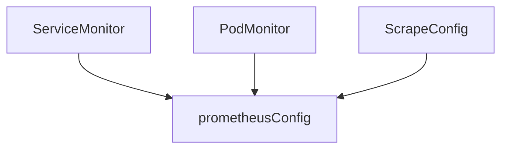
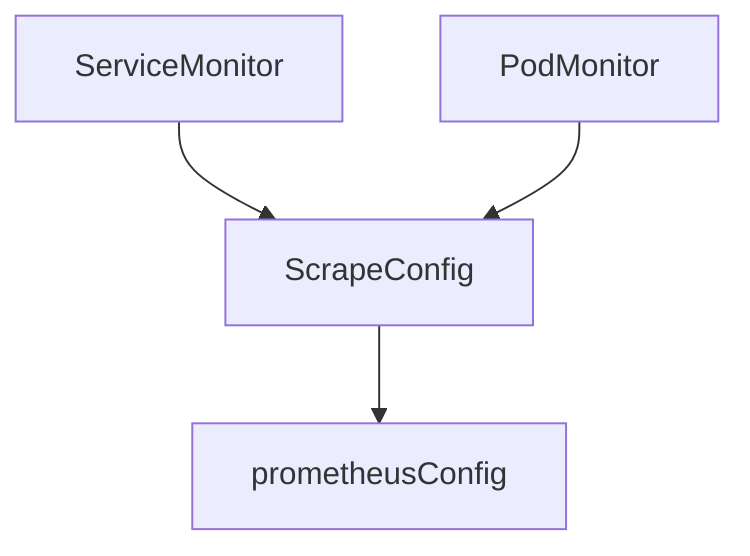

# ScrapeConfig CRD

* Owners:
  * [xiu](https://github.com/xiu)
* Status:
  * `Implemented`
* Related Tickets:
  * [#2787](https://github.com/prometheus-operator/prometheus-operator/issues/2787)
  * [#3447](https://github.com/prometheus-operator/prometheus-operator/issues/3447)
* Other docs:
  * n/a

This document aims at creating a lower level `ScrapeConfig` Custom Resource Definition that defines additional scrape
configurations the Kubernetes way.

# Why

prometheus-operator misses a way to scrape external targets using CRD. Users have either been abusing the Probe CRD
(#3447) or additionalScrapeConfig to do so. Multiple use cases have been reported:

* A user reported in the contributor office hours that their team serves Prometheus as a service to several teams across
  multiple regions. These teams have tens of thousands of exporters running outside Kubernetes. To scrape them, each
  team has to involve this user's team which makes it a bottleneck. While there is CI in place, errors happen and can
  render Prometheus' configuration to be invalid. They would like to use a CRD to help the team serve themselves in
  adding scrape configurations.
* [@auligh in #2787](https://github.com/prometheus-operator/prometheus-operator/issues/2787#issuecomment-539568397)
  reported needing a specific scrape configuration to scrape services running on the kubernetes nodes but don't have a
  Service attached to them. This user wants to deploy these scrape configurations alongside the applications rather than
  in a centralized way with `additionalScrapeConfigs`.
* [@bgagnon in #2787](https://github.com/prometheus-operator/prometheus-operator/issues/2787#issuecomment-545510764)
  mentions that `additionalScrapeConfigs`'s usage is error-prone as with usage, multiple unrelated scrape configurations
  are bundled together.

Furthermore, currently, there is a lot of code duplication due to the operator supporting several CRDs that generate
scrape configurations. With the new `ScrapeConfig` CRD, it would be possible to consolidate some of that logic, where
the other `*Monitor` CRDs could be migrated so that they create a ScrapeConfig resource that would ultimately be used by
the operator to generate scrape configuration.

## Pitfalls of the current solution

Using `additionalScrapeConfig` comes with drawbacks:

* Teams have to build an infrastructure to add scrape rules in a centralized manner, which creates a bottleneck since a
  single team becomes responsible for the configuration
* There is no input validation, which can lead to an invalid prometheus configuration

# Goals

* Provide a way for users to self-service adding scrape targets
* Consolidate the scrape configuration generation logic in a central point for other resources to use

## Audience

* Users who serve Prometheus as a service and want to have their customers autonomous in defining scrape configs
* Users who want to manage scrape configs the same way as for services running within the Kubernetes cluster
* Users who want a supported Kubernetes way of scraping targets outside the Kubernetes cluster

# Non-Goals

* This proposal doesn't aim at covering all the fields in
  [`<scrape_config>`](https://prometheus.io/docs/prometheus/latest/configuration/configuration/#scrape_config).
  Specifically, it focuses first on `static_configs`, `file_sd_configs` and `http_sd_configs`.
* Refactoring of the other CRDs is not in scope for the first version

# How

As described by
[@aulig in #2787](https://github.com/prometheus-operator/prometheus-operator/issues/2787#issuecomment-559776221), we
will create a new ScrapeConfig CRD, this new CRD will act the same as the other CRDs and append scrape configurations to
the configuration. Usage of ScrapeConfig doesn't exclude the use of the other CRDs, they are not mutually exclusive.
`ScrapeConfig` will allow for any scraping configuration, while the other CRDs provide sane defaults. This will allow
for isolated testing of the new `ScrapeConfig` CRD.



Using a pseudo custom resource definition, we should have the following:

```yaml
apiVersion: monitoring.coreos.com/v1alpha1
kind: ScrapeConfig
metadata:
  name: my-scrape-config
  namespace: system-monitoring
  labels:
    test: value
spec:
  staticConfigs:
    - <staticConfig>[] # new resource
  fileSDConfigs:
    - <fileSDConfig>[] # new resource
  httpSDConfigs:
    - <httpSDConfig>[] # new resource
  relabelings: # relabel_configs
    - <RelabelConfig>[] # https://github.com/prometheus-operator/prometheus-operator/blob/e4e27052f57040f073c6c1e4aedaecaaec77d170/pkg/apis/monitoring/v1/types.go#L1150
  metricsPath: /metrics
```

with the following new resources:

* `staticConfig`

```yaml
targets:
  - target:9100
labels:
  labelA: placeholder
```

* `fileSDConfig`:

```yaml
files:
  # Files here are string referencing a file existing in the Prometheus Pod. prometheus-operator is not responsible for
  # these SD files. The operator should use Prometheus.ConfigMaps to mount these files in the pods and have them usable
  # by ScrapeConfig. No validation on the content of the SD files is expected from prometheus-operator.
  - /etc/prometheus/configmaps/inventory/file.json
refreshInterval: 5m
```

* `httpSDConfig`:

```yaml
url: http://localhost:1234
refreshInterval: 60s
```

This example doesn't list all the fields that are offered by prometheus. The implementation of all the fields will be
done in an iterative process and as such, the expectation is not for all of them to be implemented in the first version.

Also, to help selecting `ScrapeConfig`, a new field will be added to the Prometheus CRD, same as for `ServiceMonitor`,
`PodMonitor` and `Probe` objects:

```yaml
[...]
spec:
  scrapeConfigSelector: ...
  scrapeConfigNamespaceSelector: ...
```

Once the CRD is released, we will start refactoring the other CRDs. Since `ScrapeConfig` will allow for any
configuration, it can also generate scrape configuration for the other CRDs.



# Alternatives

* Use `additionalScrapeConfig` secrets, with the pitfalls described earlier

# Action Plan

1. Create the `ScrapeConfig` CRD, covering `file_sd_configs`, `static_configs` and `http_sd_configs`. The implementation
   of every field in each service discovery mechanism is left to the implementation. The expectation is not for all of
   them to be implemented.
2. Once released, refactor the configuration generation logic to reuse `ScrapeConfig`. In parallel, add other service
   discovery mechanisms to the CRD and complete the implementation of `file_sd_configs`, `static_configs` and
   `http_sd_configs`.
