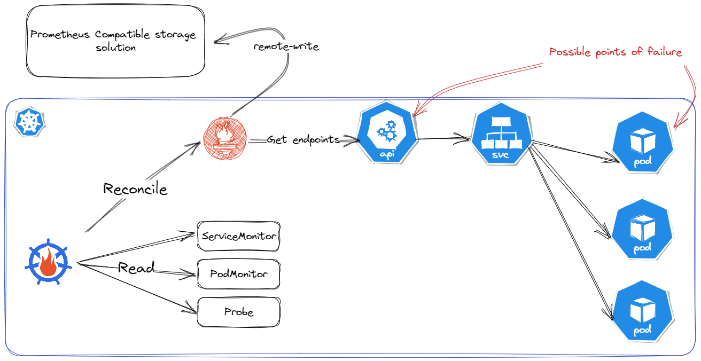
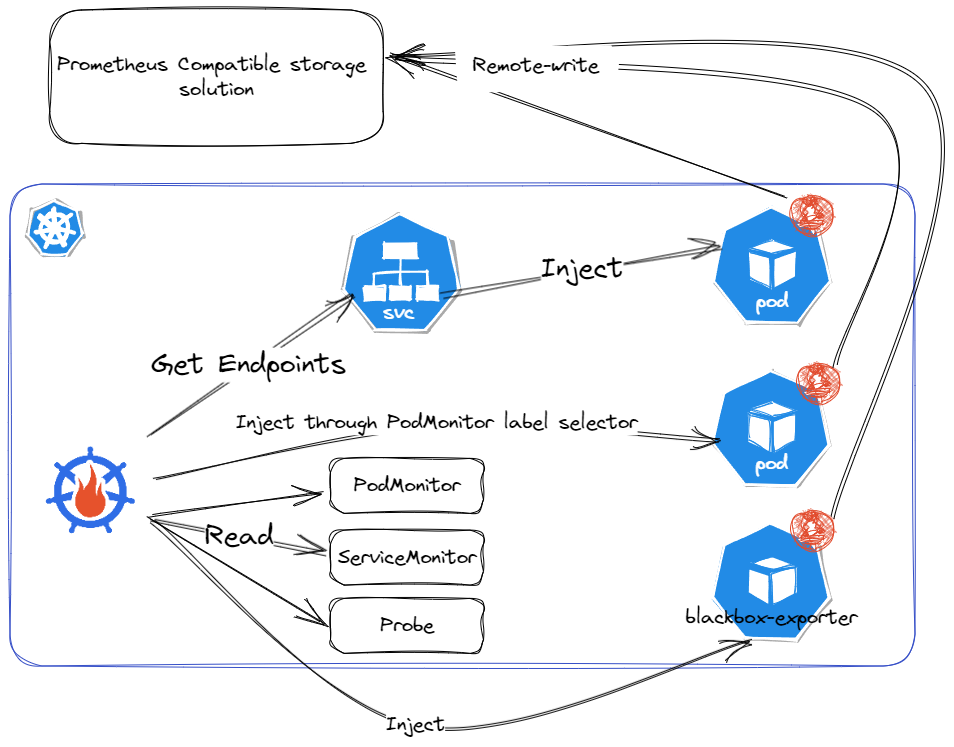

# Agent Deployment Pattern: Sidecar Injection

* Owners:
  * [ArthurSens](https://github.com/ArthurSens)
* Related Tickets:
  * [#5495](https://github.com/prometheus-operator/prometheus-operator/issues/5495)
* Other docs:
  * [Prometheus Agent Design Document](https://github.com/prometheus-operator/prometheus-operator/blob/main/Documentation/designs/prometheus-agent.md)

With Prometheus-Operator finally supporting running Prometheus in Agent mode, we can start thinking about different deployment patterns that can be explored with this minimal container. This document aims to continue the work started by [this document](https://github.com/prometheus-operator/prometheus-operator/blob/main/Documentation/designs/prometheus-agent.md), focusing on exploring how Prometheus-Operator can leverage deploying PrometheusAgents as sidecars running alongside pods that a user wants to monitor.

## Why

By the time this document was written, Prometheus-Operator can deploy Prometheus in Agent mode, but only using a pattern similar to the original implementation of Prometheus Server: using StatefulSets. The [original design document](https://github.com/prometheus-operator/prometheus-operator/blob/main/Documentation/designs/prometheus-agent.md) for Prometheus Agent already mentions that different deployment patterns are desired, however, for the sake of speeding up the initial implementation it was decided to re-use the logic and start with the Agent running as StatefulSets.

Looking at the traditional deployment model, we have a single Prometheus (or an HA setup) per cluster or namespace, responsible for scraping all containers under their scope. Prometheus operator relies on `ServiceMonitor`, `PodMonitor`, and `Probe` CRs to configure Prometheus, which will eventually use Kubernetes service-discovery to find endpoints that need to be scraped.

### Pitfalls of the current solution

Depending on the Cluster's scale and how often Prometheus hits Kubernetes API, Prometheus service discovery can increase the load on the API significantly and affect the overall functionality of said cluster.

Another problem is that one or more containers can be updated to a problematic version that causes a [Cardinality Spike](https://grafana.com/blog/2022/02/15/what-are-cardinality-spikes-and-why-do-they-matter/). Depending on the proportion of the spike, it is possible that a container could single-handedly crash the monitoring system of the whole cluster.

.

## Goals

* Allow better horizontal scalability of Prometheus.
* Provide new deployment strategies for SRE teams.

### Audience

* SRE/Platform teams that are responsible for managing Prometheus instances.
* Users who are looking for ways to horizontally scale Prometheus.

## Non-Goals

* Implement other deployment patterns, e.g. daemonset.

## How

This document proposes a new deployment model where Prometheus-Operator injects Prometheus agents as a sidecar container (and Prometheus config reloader) to pods that need to be scrapped. With a sidecar, we tackle both problems mentioned above:

> * Load on Kubernetes API won't exist since it's not needed anymore. Prometheus will scrape containers from the same pod through their shared network interface and scrape configuration can be declared via pod annotations.
> * A sudden cardinality spike will not affect the whole monitoring system. In a worst-case scenario, it will fail a single pod.

The existing PrometheusAgent CRD would be extended with a new field called `mode`, which can be one of two values(for now): [`statefulset`, `sidecar`], with `statefulset` as default. If `mode` is set to `sidecar`, Prometheus-Operator won't deploy any Prometheus agents initially. Instead, it will use `ServiceMonitor`, `PodMonitor`, and `Probes` to find pods that need to be scrapped through then inject Prometheus Agent as a sidecar to the pods found through the label selectors found in the mentioned resources.

With a visualization:



Following what other operators, e.g. OtelCollector and Istio, are doing already, we'll use [Admission Webhooks](https://kubernetes.io/docs/reference/access-authn-authz/extensible-admission-controllers/) to mutate pods with the Prometheus Agent sidecar.

The Prometheus-Operator project has implemented an admission webhook already. All that is left to do is add another route for pod mutation.

In `pkg/admission/admission.go`, we'll do the following changes:

*code edited for improved readability*

```go
func (a *Admission) Register(mux *http.ServeMux) {
	// already existing functions
	mux.HandleFunc(sidecarInjectorPath, a.serveSidecarInjector)
}

func (a *Admission) serveSidecarInjector(w http.ResponseWriter, r *http.Request) {
	a.serveAdmission(w, r, a.injectSidecar)
}

func (a *Admission) injectSidecar(ar v1.AdmissionReview) *v1.AdmissionResponse {
	a.incrementCounter(a.sidecarInjectionTriggeredCounter)

	if ar.Request.Resource != podGVR {
		err := fmt.Errorf("expected resource to be Pod, but received %v", ar.Request.Resource)
		level.Warn(a.logger).Log("err", err)
		return toAdmissionResponseFailure("Unexpected resource kind", "pod", []error{err})
	}

	pod := &corev1.Pod{}
	if err := json.Unmarshal(ar.Request.Object.Raw, pod); err != nil {
		level.Info(a.logger).Log("msg", errUnmarshalAdmission, "err", err)
		return toAdmissionResponseFailure(errUnmarshalAdmission, "pod", []error{err})
	}

	reviewResponse := &v1.AdmissionResponse{Allowed: true}

	agents, err := shoulPodBeInjected(pod)
	if err != nil {
		// We don't block pod creation if not able to get agents
		// Otherwise we could break the whole cluster.
		level.Error(a.logger).Log("msg", "Failed to discover if pod should be injected", "err", err)
		return reviewResponse
	}

	patches, err := generatePatchesForSidecarInjection(pod.Raw, agents)
	if err != nil {
		// We don't block pod creation if not able to generate patches
		// Otherwise we could break the whole cluster.
		level.Error(a.logger).Log("msg", "cannot generate patch for sidecar injection", "err", err)
		return reviewResponse
	}

	pt := v1.PatchTypeJSONPatch
	reviewResponse.PatchType = &pt
	reviewResponse.Patch = []byte(fmt.Sprintf("[%s]", strings.Join(patches, ",")))
	return reviewResponse
}

// shoulPodBeInjected checks if a given pod is selected by  PrometheusAgents through
// ServiceMonitor/PodMonitor/Probe selectors.
// If it should be injected, it returns the agents responsible for the injection.
func shoulPodBeInjected(pod corev1.Pod) ([]monitoringv1alpha1.PrometheusAgent, error) {}

// generatePatchesForSidecarInjection generates the patches necessary to inject the agent sidecar into the container
// The agent parameter is used to configure extra container flags, remote-write configs and alikes
func generatePatchesForSidecarInjection(raw []bytes, agents []monitoringv1alpha1.PrometheusAgent)
```

### Caveats

#### Extra permissions on Pods

To be able to mutate pods, the Prometheus-Operator will need extra RBAC permissions over Pods, making Prometheus-Operator an extra attack vector.

#### Webhook unavailability blocking Pod creation

As a Pod Admission

#### Config Hot Reload

While there is no research regarding the config-reloader efficiency, this particular container might become problematic for huge-scale environments, since a single change to a `ServiceMonitor`, `PodMonitor` or `PrometheusAgent` CR can potentially trigger a hot reload of millions of sidecar containers

#### WAL is not optimized for small environments

Prometheus Write-Ahead-log(WAL) is stored as a sequence of numbered files with 128MiB each by default. This means that, by default, at least 128MiB is needed for running Prometheus Agent if we ignore every other part of Prometheus. Using a sidecar, we're optimizing for horizontal scale and 128MiB might be much more than necessary to store metrics from a single Pod.

#### Lack of High-Availability setup

With the problem that Prometheus is not optimized for very small environments, injecting 2 sidecars per Pod sounds like a big waste of resources. However, with only 1 sidecar HA Prometheus won't be an option.

With that said, having an HA Prometheus in the traditional deployment pattern seems to be more critical than the sidecar approach. That's because with Prometheus fails in the first approach we lose the monitoring stack for the whole cluster, while with the latter we just lose metrics from a pod.

## Alternatives

A common pattern used with Prometheus's Kubernetes service discovery is the [usage of annotation to declaratively tell Prometheus which endpoints need to be scraped](https://www.acagroup.be/en/blog/auto-discovery-of-kubernetes-endpoint-services-prometheus/). From a [code search at Github](https://github.com/search?q=prometheus.io%2Fscrape%3A+%22true%22&type=code) for `prometheus.io/scrape: "true"`, we can tell that this approach has good adoption already. To not conflict with the already commonly used annotation, we can start with our own, but with a very similar approach. This could be used as an alternative for "Injection discovery", instead of relying on Service/PodMonitors.

If proceeding with this alternative, when `mode: agent` is set, the following fields should be ignored:

* serviceMonitorSelector
* serviceMonitorNamespaceSelector
* podMonitorSelector
* podMonitorNamespaceSelector
* probeSelector
* probeNamespaceSelector

Extra annotations would be used to configure scraping configuration and to select which PrometheusAgent CR will be responsible for the injection. For example:

```yaml
apiVersion: monitoring.coreos.com/v1alpa1
kind: PrometheusAgent
metadata:
  name: example
  namespace: monitoring
spec:
  remoteWrite:
    url: http://example.com
---
apiVersion: v1
kind: Pod
metadata:
  name: example
  annotations:
    prometheus.operator.com/scrape: true
	prometheus.operator.com/port: 8080
	prometheus.operator.com/metricspath: /metrics
	prometheus.operator.com/agent-selector: monitoring/example
```

Admission webhooks would still be necessary, only the pod discovery would be different.

## References

* [1] https://github.com/prometheus-operator/prometheus-operator/blob/main/Documentation/designs/prometheus-agent.md
* [2] https://opentelemetry.io/docs/collector/scaling/
* [3] https://www.acagroup.be/en/blog/auto-discovery-of-kubernetes-endpoint-services-prometheus/
* [4] https://ganeshvernekar.com/blog/prometheus-tsdb-wal-and-checkpoint/

## Action Plan

- [] Wip
