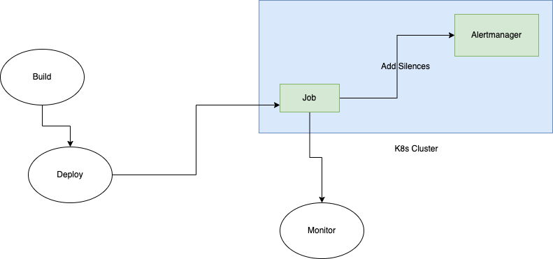

# Silence CRD

* Owners:
  * [mcbenjemaa](https://github.com/mcbenjemaa)
* Related Tickets:
  * [#5452](https://github.com/prometheus-operator/prometheus-operator/issues/5452)
  * [#2398](https://github.com/prometheus-operator/prometheus-operator/issues/2398)
* Other docs:
  * n/a

This document describes the creation of `Silence` Custom Resource Definition that defines Alertmanager silences
configurations in the Kubernetes way.

# Why

Prometheus-operator doesn't have a way to automate the management of Alertmanager silences. Users have either been using internal scripts
or an additional operator that does the job e.g. [silence-operator](https://github.com/giantswarm/silence-operator).

* Users using CI/CD jobs to manage silences have reported that this is cumbersome, since they need to either expose
  Alertmanager via an ingress or using a service account to connect to the cluster, and this is even more complicated
  in a multi-cluster setup.
  However, there's folks that uses a Kubernetes Job to adds Silences,
  In both situation, a CI/CD pipeline is needed in order to automate the execution, this includes managing the secrets and/or deprecation of code
  In the Kubernetes Job way, teams need to build and deploy a container and monitor its status, which is an additional effort.
  CI/CD pipeline is not the best option in multi-cluster setups, teams need to manage k8s access, secrets, and configs.



* Users that use a standalone operator that implements a Silence CRD are in a better situation,
  for example users have reported that they are using GitOps to fully manage the life cycle of Silences Custom resources,
  which in fact brings benefits to the whole team because having a history and revisions in Git as well as constancy to manage the silences in a multi-tenant environment.

Additionally, having a new component in the stack and keeping it maintained is not always ideal (said the folks at [Giant Swarm](https://giantswarm.io) the owners of [silence-operator](https://github.com/giantswarm/silence-operator)),
because that requires to manage an extra component +CRDs on top of the Prometheus operator.
Having the Silence CRD as part of prometheus-operator provides users with a better experience: there is no need to install another operator or build a system on top of it to provide that functionality.

By Adding support for `Silence` CRD in the prometheus-operator, this will make users more flexible in terms of choosing the tool
to deploy their silences and will free others from managing a standalone component within the stack.

## Pitfalls of the current solution

Using Alertmanager API Directly comes with drawbacks:

* Teams have to build an automation to add silences in a centralized manner
* There is no input validation, which can lead to an invalid silence configuration
* Teams need to manage expiration on their own
* If a silence was deleted by accident, it will be permanent.

# Goals

* Provide a way for users to manage Alertmanager silences with a Custom Resource Definition (CRD).
* Enable management of Alertmanager silences via centralised repo with e.g. ArgoCD, Flux...
* Multi tenancy: Silences CR can be using kubernetes rbac.
* Moving the Giant Swarm silence operator to prometheus operator would provide better community support and less fragmentation.
* Improve user experience when managing silences, so users can use the same tools to manage their monitoring pipeline (kyverno, cr validations).

## Audience

* Users who use the Prometheus operator to offer monitoring-as-a-service to developers.
* Users who want to manage silences the same way as for services running within the Kubernetes cluster.
* Users who want a supported Kubernetes way of silences outside the Kubernetes cluster

# Non-Goals

* This proposal do not cover automatic cleanup of expired Silence CRs
* Refactoring of the other CRDs is not in scope for the first version
* Adding silences to a remote Alertmanager cluster

# How

Creating a new namespaced Silence CRD that will act as an interface by adding silences via the Alertmanager API.

A typical `Silence` resource could look like the following:

```yaml
apiVersion: monitoring.coreos.com/v1alpha1
kind: Silence
metadata:
  name: my-silence
  namespace: monitoring
  labels:
    test: value
spec:
  expiresAt: "2023-06-01"
  matchers:
    - name: namespace
      value: test-ns
      isRegex: false
```

* `expiresAt` to define the expiration of the silence.
  - If a silence has `expiredAt` defined, it'll expire at the time defined and the CR will have to be manually removed.
  - If a silence doesn't have `expiredAt`, it'll be kept active as long as the CR exists and removed as soon as the CR is gone
* `matchers` field corresponds to the Alertmanager silence matchers each of which consists of:
  - `name` - name of tag on an alert to match
  - `value` - fixed string or expression to match against the value of the tag named by name above on an alert
  - `isRegex` - a boolean specifying whether to treat value as a regex (=~) or a fixed string (=)
  - `isEqual` - a boolean specifying whether to use equal signs (= or =~) or to negate the matcher (!= or !~)

This example doesn't list all the fields that are offered by Alertmanager. The implementation of all the fields will be
done in an iterative process and as such, the expectation is not for all of them to be implemented in the first version.

Also, to help select `Silences`, a new field will be added to the Alertmanager CRD:

```yaml
[...]
spec:
  silenceSelector: ...
  silenceNamespaceSelector: ...
```

# Alternatives

* Use Alertmanager API
* Use [silence-operator](https://github.com/giantswarm/silence-operator)

# Action Plan

1. Create the `Silence` CRD, covering `selector`, `matchers` and `expiresAt`.
2. Once released, add other mechanisms to the CRD and complete the implementation.
