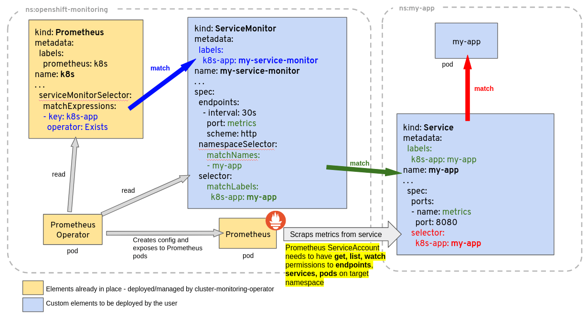

<br>
<div class="alert alert-info" role="alert">
    <i class="fa fa-exclamation-triangle"></i><b> Note:</b> Starting with v0.12.0, Prometheus Operator requires use of Kubernetes v1.7.x and up.
</div>

# FAQ / Troubleshooting

### RBAC on Google Container Engine (GKE)

When you try to create `ClusterRole` (`kube-state-metrics`, `prometheus` `prometheus-operator`, etc.) on GKE Kubernetes cluster running 1.6 version, you will probably run into permission errors:

```
<....>
Error from server (Forbidden): error when creating 
"manifests/prometheus-operator/prometheus-operator-cluster-role.yaml": 
clusterroles.rbac.authorization.k8s.io "prometheus-operator" is forbidden: attempt to grant extra privileges:
<....>
````

This is due to the way Container Engine checks permissions. From [Google Container Engine docs](https://cloud.google.com/container-engine/docs/role-based-access-control):

> Because of the way Container Engine checks permissions when you create a Role or ClusterRole, you must first create a RoleBinding that grants you all of the permissions included in the role you want to create.
> An example workaround is to create a RoleBinding that gives your Google identity a cluster-admin role before attempting to create additional Role or ClusterRole permissions.
> This is a known issue in the Beta release of Role-Based Access Control in Kubernetes and Container Engine version 1.6.

To overcome this, you must grant your current Google identity `cluster-admin` Role:

```console
# get current google identity
$ gcloud info | grep Account
Account: [myname@example.org]

# grant cluster-admin to your current identity
$ kubectl create clusterrolebinding myname-cluster-admin-binding --clusterrole=cluster-admin --user=myname@example.org
Clusterrolebinding "myname-cluster-admin-binding" created
```

### Troubleshooting ServiceMonitor changes

When creating/deleting/modifying `ServiceMonitor` objects it is sometimes not as obvious what piece is not working properly. This section gives a step by step guide how to troubleshoot such actions on a `ServiceMonitor` object.

#### Overview of `ServiceMonitor` tagging and related elements

A common problem related to `ServiceMonitor` identification by Prometheus is related to an incorrect tagging, that does not match the `Prometheus` custom resource definition scope, or lack of permission for the Prometheus `ServiceAccount` to *get, list, watch* `Services` and `Endpoints` from the target application being monitored. As a general guideline consider the diagram below, giving an example of a `Deployment` and `Service` called `my-app`, being monitored by Prometheus based on a `ServiceMonitor` named `my-service-monitor`:



#### Has my `ServiceMonitor` been picked up by Prometheus?

`ServiceMonitor` objects are selected by the `serviceMonitorSelector` of a Prometheus object. The name of a `ServiceMonitor` is encoded in the Prometheus configuration, so you can simply grep whether it is present there. The configuration generated by the Prometheus Operator is stored in a Kubernetes `Secret`, named after the Prometheus object name prefixed with `prometheus-` and is located in the same namespace as the Prometheus object. For example for a Prometheus object called `k8s` one can find out if the `ServiceMonitor` named `my-service-monitor` has been picked up with:

```
kubectl -n monitoring get secret prometheus-k8s -ojson | jq -r '.data["prometheus.yaml"]' | base64 -d | grep "my-service-monitor"
```

### Prometheus kubelet metrics server returned HTTP status 403 Forbidden

Prometheus is installed, all looks good, however the `Targets` are all showing as down. All permissions seem to be good, yet no joy. Prometheus pulling metrics from all namespaces expect kube-system, and Prometheus has access to all namespaces including kube-system.

#### Did you check the webhooks?

Issue has been resolved by amending the webhooks to use `0.0.0.0` instead of `127.0.0.1`. Follow the below commands and it will update the webhooks which allows connections to all `clusterIP's`  in all `namespaces` and not just `127.0.0.1`.

**Update the kubelet service to include webhook and restart:**
```
KUBEADM_SYSTEMD_CONF=/etc/systemd/system/kubelet.service.d/10-kubeadm.conf
sed -e "/cadvisor-port=0/d" -i "$KUBEADM_SYSTEMD_CONF"
if ! grep -q "authentication-token-webhook=true" "$KUBEADM_SYSTEMD_CONF"; then
  sed -e "s/--authorization-mode=Webhook/--authentication-token-webhook=true --authorization-mode=Webhook/" -i "$KUBEADM_SYSTEMD_CONF"
fi
systemctl daemon-reload
systemctl restart kubelet
```

**Modify the kube controller and kube scheduler to allow for reading data:**
```
sed -e "s/- --address=127.0.0.1/- --address=0.0.0.0/" -i /etc/kubernetes/manifests/kube-controller-manager.yaml
sed -e "s/- --address=127.0.0.1/- --address=0.0.0.0/" -i /etc/kubernetes/manifests/kube-scheduler.yaml
```

