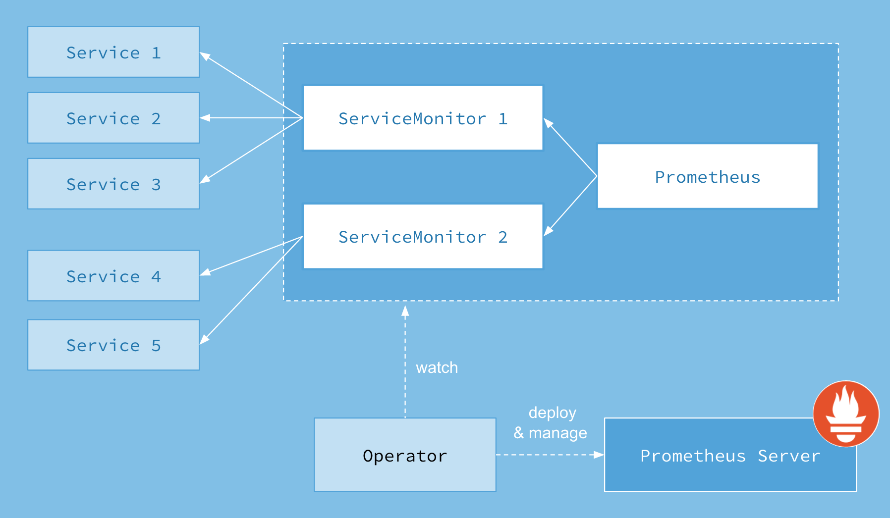

<br>
<div class="alert alert-info" role="alert">
    <i class="fa fa-exclamation-triangle"></i><b> Note:</b> Starting with v0.12.0, Prometheus Operator requires use of Kubernetes v1.7.x and up.<br><br>
This documentation is for an alpha feature. For questions and feedback on the Prometheus OCS Alpha program, email <a href="mailto:tectonic-alpha-feedback@coreos.com">tectonic-alpha-feedback@coreos.com</a>.
</div>

# Prometheus Operator

Operators were introduced by CoreOS as a class of software that operates other software, putting operational knowledge collected by humans into software. Read more in the original blog post, [Introducing Operators][introducing-operators].

The Prometheus Operator serves to make running Prometheus on top of Kubernetes as easy as possible, while preserving Kubernetes-native configuration options.

## Example Prometheus Operator manifest

To follow this getting started you will need a Kubernetes cluster you have access to. This example describes a Prometheus Operator Deployment, and its required ClusterRole, ClusterRoleBinding, and Service Account.

[embedmd]:# (../../bundle.yaml)
```yaml
apiVersion: rbac.authorization.k8s.io/v1
kind: ClusterRoleBinding
metadata:
  name: prometheus-operator
roleRef:
  apiGroup: rbac.authorization.k8s.io
  kind: ClusterRole
  name: prometheus-operator
subjects:
- kind: ServiceAccount
  name: prometheus-operator
  namespace: default
---
apiVersion: rbac.authorization.k8s.io/v1
kind: ClusterRole
metadata:
  name: prometheus-operator
rules:
- apiGroups:
  - apiextensions.k8s.io
  resources:
  - customresourcedefinitions
  verbs:
  - '*'
- apiGroups:
  - monitoring.coreos.com
  resources:
  - alertmanagers
  - prometheuses
  - prometheuses/finalizers
  - alertmanagers/finalizers
  - servicemonitors
  - prometheusrules
  verbs:
  - '*'
- apiGroups:
  - apps
  resources:
  - statefulsets
  verbs:
  - '*'
- apiGroups:
  - ""
  resources:
  - configmaps
  - secrets
  verbs:
  - '*'
- apiGroups:
  - ""
  resources:
  - pods
  verbs:
  - list
  - delete
- apiGroups:
  - ""
  resources:
  - services
  - services/finalizers
  - endpoints
  verbs:
  - get
  - create
  - update
  - delete
- apiGroups:
  - ""
  resources:
  - nodes
  verbs:
  - list
  - watch
- apiGroups:
  - ""
  resources:
  - namespaces
  verbs:
  - get
  - list
  - watch
---
apiVersion: apps/v1beta2
kind: Deployment
metadata:
  labels:
    k8s-app: prometheus-operator
  name: prometheus-operator
  namespace: default
spec:
  replicas: 1
  selector:
    matchLabels:
      k8s-app: prometheus-operator
  template:
    metadata:
      labels:
        k8s-app: prometheus-operator
    spec:
      containers:
      - args:
        - --kubelet-service=kube-system/kubelet
        - --logtostderr=true
        - --config-reloader-image=quay.io/coreos/configmap-reload:v0.0.1
        - --prometheus-config-reloader=quay.io/coreos/prometheus-config-reloader:v0.29.0
        image: quay.io/coreos/prometheus-operator:v0.29.0
        name: prometheus-operator
        ports:
        - containerPort: 8080
          name: http
        resources:
          limits:
            cpu: 200m
            memory: 200Mi
          requests:
            cpu: 100m
            memory: 100Mi
        securityContext:
          allowPrivilegeEscalation: false
          readOnlyRootFilesystem: true
      nodeSelector:
        beta.kubernetes.io/os: linux
      securityContext:
        runAsNonRoot: true
        runAsUser: 65534
      serviceAccountName: prometheus-operator
---
apiVersion: v1
kind: ServiceAccount
metadata:
  name: prometheus-operator
  namespace: default
```

## Related resources

The Prometheus Operator introduces additional resources in Kubernetes to declare the desired state of a Prometheus and Alertmanager cluster as well as the Prometheus configuration. The resources it introduces are:

* `Prometheus`
* `Alertmanager`
* `ServiceMonitor`

> See the [Alerting guide][alerting-guide] for more information about the `Alertmanager` resource, or the [Design document][design-doc] for an overview of all resources introduced by the Prometheus Operator.

The Prometheus resource declaratively describes the desired state of a Prometheus deployment, while a ServiceMonitor describes the set of targets to be monitored by Prometheus.



The Prometheus resource includes a field called `serviceMonitorSelector`, which defines a selection of ServiceMonitors to be used. By default and before the version `v0.19.0`, ServiceMonitors must be installed in the same namespace as the Prometheus instance. With the Prometheus Operator `v0.19.0` and above, ServiceMonitors can be selected outside the Prometheus namespace via the `serviceMonitorNamespaceSelector` field of the Prometheus resource.

First, deploy three instances of a simple example application, which listens and exposes metrics on port `8080`.

[embedmd]:# (../../example/user-guides/getting-started/example-app-deployment.yaml)
```yaml
apiVersion: extensions/v1beta1
kind: Deployment
metadata:
  name: example-app
spec:
  replicas: 3
  template:
    metadata:
      labels:
        app: example-app
    spec:
      containers:
      - name: example-app
        image: fabxc/instrumented_app
        ports:
        - name: web
          containerPort: 8080
```

The ServiceMonitor has a label selector to select Services and their underlying Endpoint objects. The Service object for the example application selects the Pods by the `app` label having the `example-app` value. The Service object also specifies the port on which the metrics are exposed.

[embedmd]:# (../../example/user-guides/getting-started/example-app-service.yaml)
```yaml
kind: Service
apiVersion: v1
metadata:
  name: example-app
  labels:
    app: example-app
spec:
  selector:
    app: example-app
  ports:
  - name: web
    port: 8080
```

This Service object is discovered by a ServiceMonitor, which selects in the same way. The `app` label must have the value `example-app`.

[embedmd]:# (../../example/user-guides/getting-started/example-app-service-monitor.yaml)
```yaml
apiVersion: monitoring.coreos.com/v1
kind: ServiceMonitor
metadata:
  name: example-app
  labels:
    team: frontend
spec:
  selector:
    matchLabels:
      app: example-app
  endpoints:
  - port: web
```

## Enable RBAC rules for Prometheus pods

If [RBAC][rbac-auth] authorization is activated, you must create RBAC rules for both Prometheus *and* Prometheus Operator. A ClusterRole and a ClusterRoleBinding for the Prometheus Operator were created in the example Prometheus Operator manifest above. The same must be done for the Prometheus Pods.

Create a ClusterRole and ClusterRoleBinding for the Prometheus Pods:

[embedmd]:# (../../example/rbac/prometheus/prometheus-service-account.yaml)
```yaml
apiVersion: v1
kind: ServiceAccount
metadata:
  name: prometheus
```

[embedmd]:# (../../example/rbac/prometheus/prometheus-cluster-role.yaml)
```yaml
apiVersion: rbac.authorization.k8s.io/v1beta1
kind: ClusterRole
metadata:
  name: prometheus
rules:
- apiGroups: [""]
  resources:
  - nodes
  - services
  - endpoints
  - pods
  verbs: ["get", "list", "watch"]
- apiGroups: [""]
  resources:
  - configmaps
  verbs: ["get"]
- nonResourceURLs: ["/metrics"]
  verbs: ["get"]
```

[embedmd]:# (../../example/rbac/prometheus/prometheus-cluster-role-binding.yaml)
```yaml
apiVersion: rbac.authorization.k8s.io/v1beta1
kind: ClusterRoleBinding
metadata:
  name: prometheus
roleRef:
  apiGroup: rbac.authorization.k8s.io
  kind: ClusterRole
  name: prometheus
subjects:
- kind: ServiceAccount
  name: prometheus
  namespace: default
```

For more information, see the [Prometheus Operator RBAC guide][prom-rbac].

## Include ServiceMonitors

Finally, a Prometheus object defines the `serviceMonitorSelector` to specify which ServiceMonitors should be included. Above the label `team: frontend` was specified, so that's what the Prometheus object selects by.

[embedmd]:# (../../example/user-guides/getting-started/prometheus.yaml)
```yaml
apiVersion: monitoring.coreos.com/v1
kind: Prometheus
metadata:
  name: prometheus
spec:
  serviceAccountName: prometheus
  serviceMonitorSelector:
    matchLabels:
      team: frontend
  resources:
    requests:
      memory: 400Mi
  enableAdminAPI: false
```

> If you have RBAC authorization activated, use the RBAC aware [Prometheus manifest][prometheus-manifest] instead.

This enables the frontend team to create new ServiceMonitors and Services which allow Prometheus to be dynamically reconfigured.

## Expose the Prometheus instance

To access the Prometheus instance it must be exposed to the outside. This example exposes the instance using a Service of type `NodePort`.

[embedmd]:# (../../example/user-guides/getting-started/prometheus-service.yaml)
```yaml
apiVersion: v1
kind: Service
metadata:
  name: prometheus
spec:
  type: NodePort
  ports:
  - name: web
    nodePort: 30900
    port: 9090
    protocol: TCP
    targetPort: web
  selector:
    prometheus: prometheus
```

Once this Service is created the Prometheus web UI is available under the node's IP address on port `30900`. The targets page in the web UI now shows that the instances of the example application have successfully been discovered.

> Exposing the Prometheus web UI may not be an applicable solution. Read more about the possibilities of exposing it in the [exposing Prometheus and Alertmanager guide][exposing-prom].

## Expose the Prometheus Admin API

Prometheus Admin API allows access to delete series for a certain time range, cleanup tombstones, capture snapshots, etc. More information about the admin API can be found in [Prometheus official documentation](https://prometheus.io/docs/prometheus/latest/querying/api/#tsdb-admin-apis)
This API access is disabled by default and can be toggled using this boolean flag. The following example exposes the admin API:

> WARNING: Enabling the admin APIs enables mutating endpoints, to delete data,
> shutdown Prometheus, and more. Enabling this should be done with care and the
> user is advised to add additional authentication authorization via a proxy to
> ensure only clients authorized to perform these actions can do so.

[embedmd]:# (../../example/user-guides/getting-started/prometheus.yaml)
```yaml
apiVersion: monitoring.coreos.com/v1
kind: Prometheus
metadata:
  name: prometheus
spec:
  serviceAccountName: prometheus
  serviceMonitorSelector:
    matchLabels:
      team: frontend
  resources:
    requests:
      memory: 400Mi
  enableAdminAPI: false
```

Further reading:

* [Alerting][alerting-guide] describes using the Prometheus Operator go manage Alertmanager clusters.

* [Cluster Monitoring ][cluster-monitoring] describes using the Prometheus Operator to monitor the Kubernetes cluster itself.


[alerting-guide]: alerting.md
[cluster-monitoring]: cluster-monitoring.md
[design-doc]: ../design.md
[exposing-prom]: exposing-prometheus-and-alertmanager.md
[introducing-operators]: https://coreos.com/blog/introducing-operators.html
[prom-rbac]: ../rbac.md
[prometheus-manifest]: ../../example/rbac/prometheus/prometheus.yaml
[rbac-auth]: https://kubernetes.io/docs/admin/authorization/
