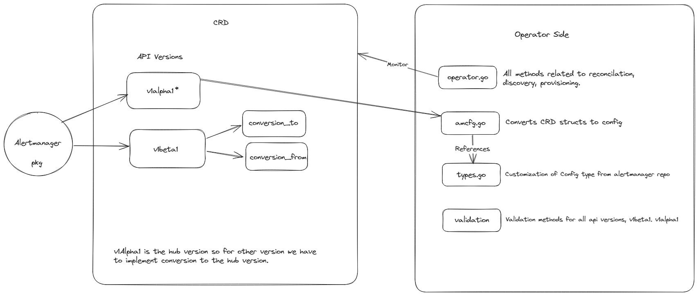

## Alertmanager Package 

The alertmanager package and CRDs together make up the alertmanager integration in the prometheus operator. Here is a 
quick overview of the overall package: 

 

### CRDs 
Prometheus operator supports two CRDs related to Alertmanager. 

- Alertmanager CRD: Defines the alertmanager statefulset. 
- AlertmanagerConfig CRD: Deines the config for the alertmanager instances.

The Alertmanager CRD is in  [v1](https://github.com/prometheus-operator/prometheus-operator/blob/main/README.md#project-status). 
while AlertmanagerConfig CRD is currently in [beta](https://github.com/prometheus-operator/prometheus-operator/blob/main/README.md#project-status). 

These CRDs are then picked up, validated and converted by the operator into configs.  

### Updating AlertmanagerConfig CRD
If you are looking to make changes to the AlertmanagerConfig CRD, you would probably be making changes to the following files and for the reasons mentioned 

- <b>pkg/apis/monitoring/v1alpa1/alertmanager_config_types.go </b>
      Update/Add/Delete the config in alpha. 

- <b> pkg/apis/monitoring/v1beta1/alertmanager_config_types.go </b> 
      Update/Add/Delete the config in beta. 

- <b> pkg/apis/monitoring/v1beta1/conversion_from.go</b> 
     Add conversion logic as Beta needs to be convertible from the hub version(alpha). 

- <b>pkg/apis/monitoring/v1beta1/conversion_to.go</b> 
     Add conversion logic as Beta needs to be convertible to the hub version(alpha). 

- <b>pkg/alertmanager/amcfg.go</b> 
     CRD to config object conversion logic. 

- <b>pkg/alertmanager/validation/validation.go</b> 
     Core validation methods for validating the fields in the config.

- <b>pkg/alertmanager/validation/v1alpha1/validation.go</b> 
     Version specific validation methods for validating the fields in the config.

- <b>pkg/alertmanager/validation/v1alpha1/validation.go</b> 
     Version specific validation methods for validating the fields in the config.

You may need to change all or some of the above files. You can refer to [#5886](https://github.com/prometheus-operator/prometheus-operator/pull/5886)  as an example. 

